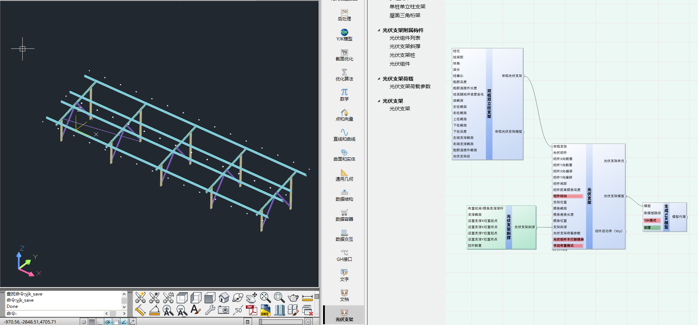
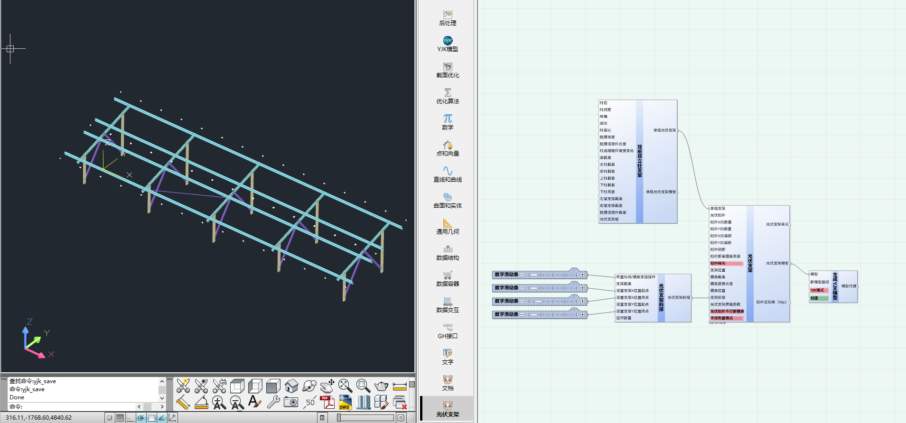
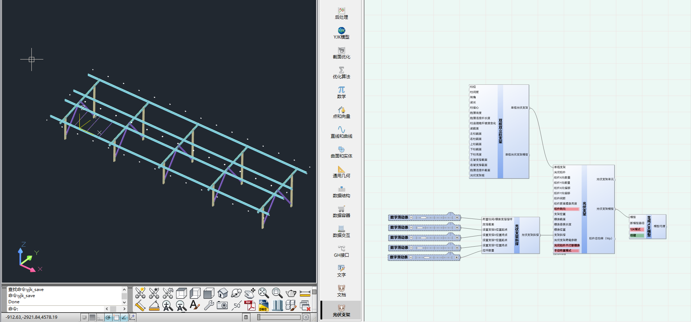

# 光伏支架斜撑

光伏支架斜撑

## 输入端(InputSide)

|名称|描述|数据结构|数据类型|
|:--|:--|:--|:--|
|布置柱间/檩条支撑撑杆|0为布置柱间支撑，1为布置檩条间支撑，2为布置檩条间拉杆|单个数据|Int32
|支撑截面|支撑截面|单个数据|NSFrameSection
|设置支撑X位置起点|设置柱间支撑X位置起点|单个数据|Int32
|设置支撑X位置终点|设置柱间支撑X位置终点|单个数据|Int32
|设置支撑Y位置起点|设置柱间支撑Y位置起点|单个数据|Int32
|设置支撑Y位置终点|设置柱间支撑Y位置终点|单个数据|Int32
|拉杆数量|拉杆数量|单个数据|Int32

## 输出端(OutputSide)

|名称|描述|数据结构|数据类型|
|:--|:--|:--|:--|
|光伏支架斜撑|光伏支架斜撑|单个数据|PVMidBraceTag

## 示例

