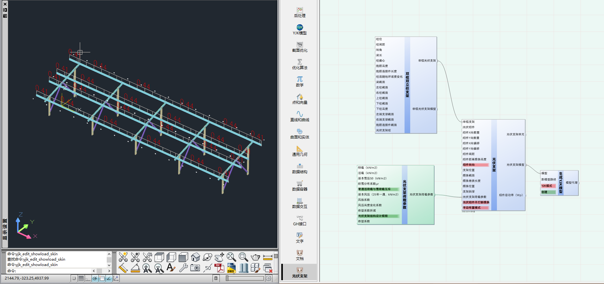

# 光伏支架荷载参数

光伏支架荷载，鼠标左键双击可勾选计算的荷载，默认全选

## 输入端(InputSide)

|名称|描述|数据结构|数据类型|
|:--|:--|:--|:--|
|恒载（kN/m2）|恒荷载|容器数据|Double
|活载（kN/m2）|活荷载|容器数据|Double
|基本雪压S0（kN/m2）|基本雪压S0（kN/m2）|容器数据|Double
|积雪分布系数μr|积雪分布系数μr|容器数据|Double
|基本风压（25年一遇，kN/m2）|基本风压（25年一遇，kN/m2）|容器数据|Double
|风振/阵风系数|风振/阵风系数|容器数据|Double
|风压高度变化系数|风压高度变化系数|容器数据|Double
|体型系数折减|体型系数折减|容器数据|Double
|普通活荷载与雪荷载互斥||单个数据|Boolean
|体型系数| 选择使用整体体型系数或局部体型系数|单个数据|Boolean
|体型系数设计规范| 光伏发电站设计规范：第6.8.7条，地面和楼顶支架风荷载的体型系数取1.3，建筑物立面安装的支架风荷载的确定应符合《建筑结构荷载规范》GB50009的要求，软件默认1.3|单个数据|Boolean
|体型系数|体型系数，不输入时软件默认自动计算|容器数据|Double

## 输出端(OutputSide)

|名称|描述|数据结构|数据类型|
|:--|:--|:--|:--|
|光伏支架荷载参数|光伏支架荷载参数|单个数据|NSPVLoadParams

## 示例

