# Y-GAMA光伏支架模块介绍

## Y-GAMA光伏模块

光伏支架结构设计的时候总结了以下三个痛点。
痛点1：传统建模方式建立和修改模型繁琐，例如调整支架间距的工作都需要从建模开始，施加荷载等都需要重新计算并施加。
痛点2：界面类的参数化建模抽象，不能直观看到建立模型的样子， 修改模型仍需要反复打开界面输入参数。
痛点3：截面优化费时费力，不能自动的优化材料用量。
为了解决以上痛点，Y-GAMA推出了光伏支架模块，Y-GAMA光伏模块简化了建立光伏支架模型的流程，实现了参数化修改模型并可以直观的看到，并且可以将任何建模参数作为优化参数进行优化工作。下面小编将介绍Y-GAMA包含的内容和工作流程。

## 单榀光伏支架类型

单榀光伏支架目前有5种形式分别为单桩单立柱、单桩双立柱、双桩双立柱、屋顶三角桁架、多柱。

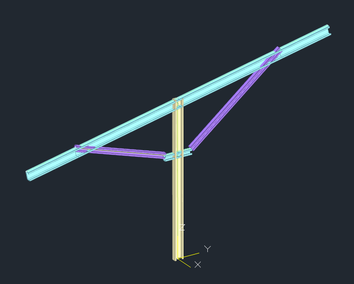  

单桩单立柱支架

 

单桩双立柱支架

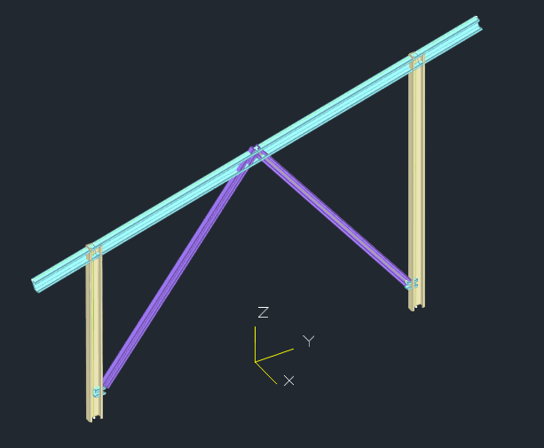

 

双桩双立柱支架

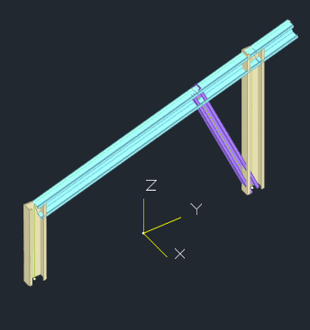

 

屋面三角桁架

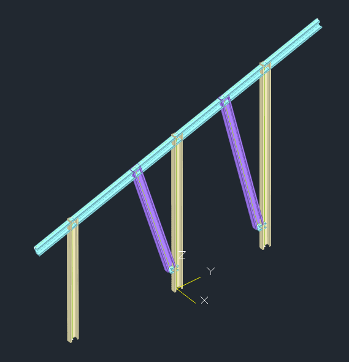

 

屋面三角桁架

## 光伏支架组件

光伏组件如下图所示可鼠标右键选择光伏组件材料：非晶硅、单晶硅、多晶硅。卡片可定义组件长度、宽度、厚度、质量和峰瓦值。Y-GAMA在檩条上生成的组件板如图3-1所示，默认情况下Y方向为长度，X方向为宽度。

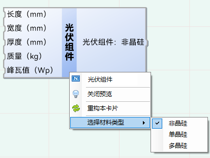  

光伏组件卡片

  

生成的光伏组件模型

## 光伏支架桩类型

光伏支架桩如下图所示，可鼠标右键卡片选择方形桩：预制方桩，圆形桩：水下冲钻孔桩、沉管灌注桩、干作业钻挖孔桩、锚杆，圆管形桩：预制砼管桩、钢管桩。以预制方桩为例，可设置桩边长、水平承载力、竖向承载力、抗拔承载力、桩顶柱底高差、桩长、抗压刚度、抗拉刚度、抗弯刚度、旋转角度，Y-GAMA在柱底生成的桩模型如图所示。

光伏支架桩卡片

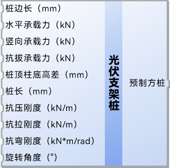

光伏支架桩模型

## 光伏支架支撑类型

光伏支架斜撑如下图所示，卡片第一个接口通过数字控制生成的斜撑类型，0为柱间支撑、1为檩条间支撑、2为檩条间拉杆。通过设置X、Y方向的起点和终点控制生成的斜撑的方向。以檩条间拉杆为例，如图所示，各个参数含义如下：第1个入口接入数字滑动条2表示欲生成的斜撑为檩条间拉杆，第2个入口没有接入，则拉杆截面使用默认截面直径为10mm的圆形钢棒，X位置起点为2，终点为4，表示从左到右第2个支架开始到第4个支架结束。Y位置起点为1，终点为4，从前到后檩条，第1道檩条位置为0，最后一道檩条位置为3，表示从位置1檩条到位置3檩条结束。最后一个入口为拉杆数量，这里接入数字3 表示有三道拉杆，将檩条4等分。和Y-PV保持一致，最多可设置4道拉杆。

 

光伏支架斜撑卡片

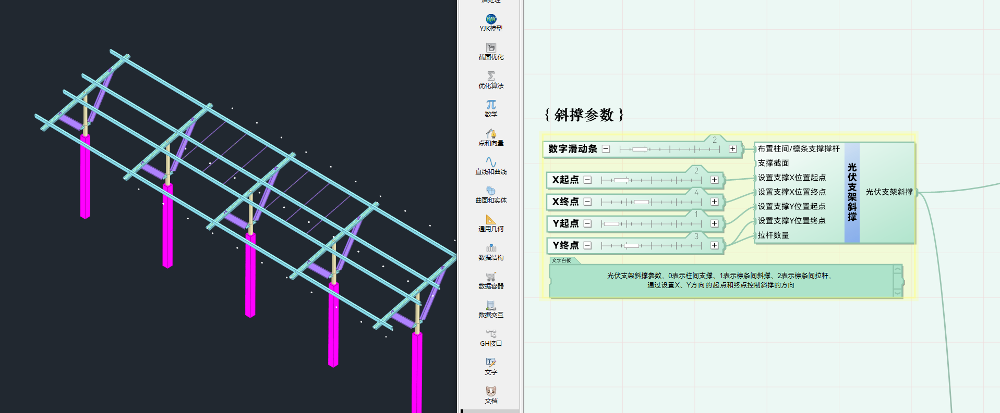  

生成的斜撑模型

## 光伏支架荷载

光伏支架荷载卡片如图所示，可设置恒载、活载、基本雪压、积雪分布系数、雪活互斥、基本风压、风振系数、风压高度变化系数、体型折减系数，Y-GAMA体型系数可根据用户所选择规范自动计算，用户也可自行输入体型系数，卡片则按用户输入的系数计算。
Y-GAMA可根据用户布置的组件计算并施加在檩条上，同时考虑到支架间组件不满布、组件悬挑超出檩条悬挑长度的情况，如图所示。
GAMA可根据用户指定计算整体体型系数局部体型系数。整体体型系数按照+Y风、-Y风工况分别取us1、us2中线性插值系数。局部体型系数按照梁所在区域计算其承受风荷载面积的加权平均值，以图例，计算图中蓝色梁局部体型系数下风荷载计算方式为，取横向梁长和竖向梁所分担的组件板的宽度所组成的绿色矩形，此矩形按组件板局部体型系数表中的方法分隔为四个小矩形，分别计算其面积与局部体型系数的乘积，取前述四个乘积与绿色矩形的总面积相除，即为此梁的局部体型系数。

  

 

光伏支架荷载参数卡片

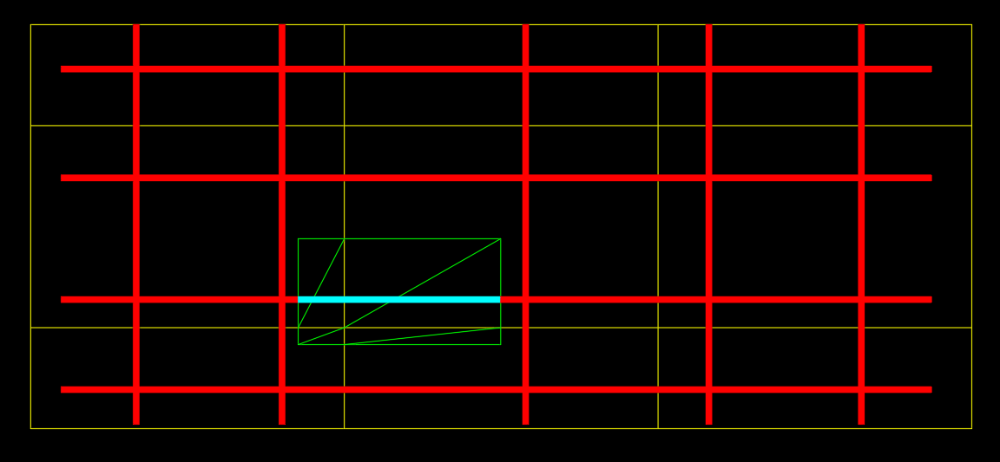 

局部风荷载计算方式

  

满布荷载

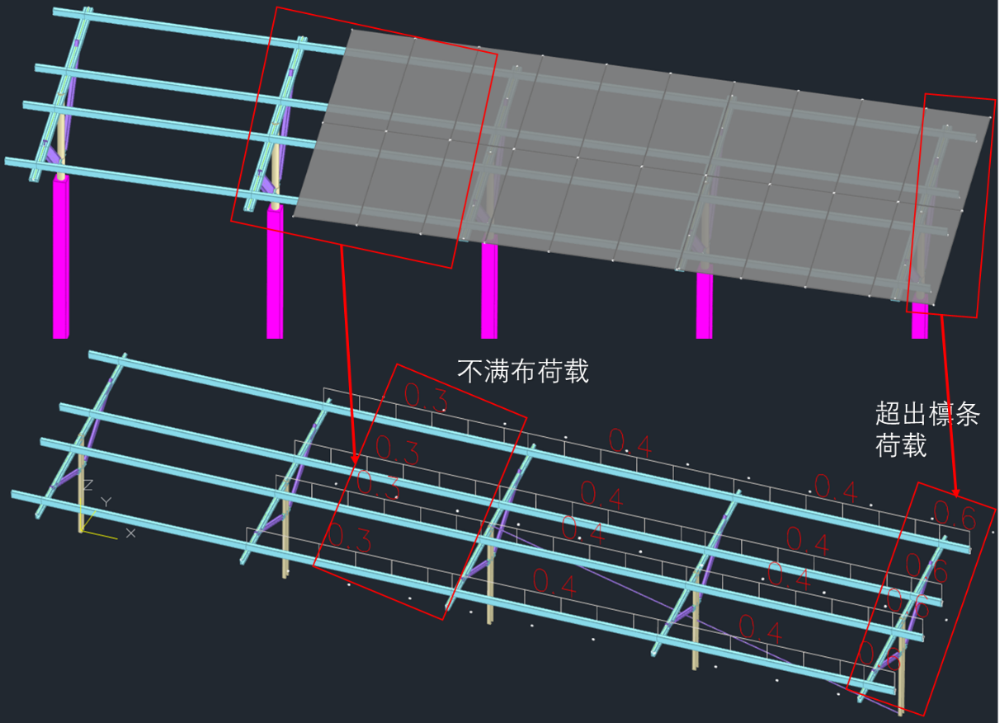 

不满布荷载

## 光伏支架工作流程

### 参数化流程简介

将卡片拉入画布，用户可定义组件尺寸和数量、荷载参数、支架类型，点开生成YJK模型，如图所示。用户任意拖动数字滑动条修改模型，并在盈建科视口中实时查看

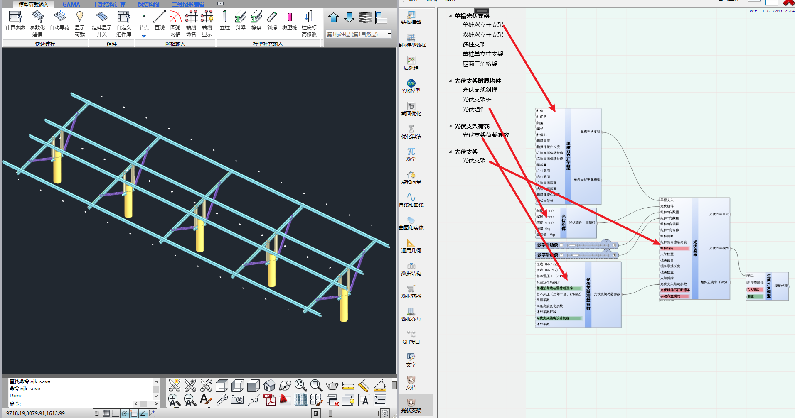  

参数化建模实例

### 单榀参数定义

柱位通过光伏支架左柱（前柱）的顶点的三维点坐标控制单榀光伏支架的位置，梁长、转角控制单榀光伏支架的梁长和转角，转角为梁与x，y水平面的倾角柱偏心为柱子与梁起点之间偏移的距离，默认柱偏心为0，即柱位于梁中心。抱箍长度、高度控制抱箍的柱端到抱箍端点的长度，高度为柱底到抱箍的长度，支撑偏移长度为支撑梁端到支撑的距离。当截面卡片接入单榀光伏支架上下柱截面入口时，建立大管套小管模型。
截面可通过三种方式输入单榀光伏支架：1、预先将型钢截面选中到型钢截面列表中，通过提取列表项与索引数字输入到支架卡片，这种输入方式可作为优化参数使用2、通过型钢类型卡片选择单独一种型钢截面3、通过框架截面选择截面类型，输入参数自定义截面类型支撑截面只输入左端或右端时，另外一端截面自动使用输入的一端截面。
光伏支架桩有：预制方桩、水下冲钻孔桩、沉管灌注桩、干作业钻挖孔桩、预制砼管桩、钢管桩、锚杆截面形式；方形桩截面输入边长参数，默认值为200mm，圆形桩截面输入桩直径参数，默认值为200mm，圆管形桩截面输入桩直径与桩壁厚参数，默认直径200mm、壁厚20mm，桩顶柱底高差即为桩顶超过地坪高。如图所示。
多柱截面表示柱子从左到右柱的截面，当输入的参数数量少于多柱间距时，缺省的参数选择上一个输入的参数作为自身的参数如上方参数表示：左2柱截面为I20a，左3柱截面为U41.3x72x7.5x2.75，左4柱截面为U41.3x72x7.5x2.75。单桩双立柱支架卡片抱箍高度最多可输入三个参数，第一个拉入的参数为第一个（最下面的）抱箍距离驻地的 高度，第二第三个参数为中间抱箍和最上抱箍的位置参数。如上参数输入即表示最下方抱箍距离柱底高度为500mm，中间抱箍与最下方抱箍间距100mm，最上方抱箍与中间抱箍间距150mm。柱间距表示左柱（前柱）柱与右柱（后柱）柱Y方向之间间距。柱底随地坪坡度变化为左柱（前柱）柱底与右柱（后柱）柱底连线与Y轴之间夹角角度。如图所示。

  

单榀参数A

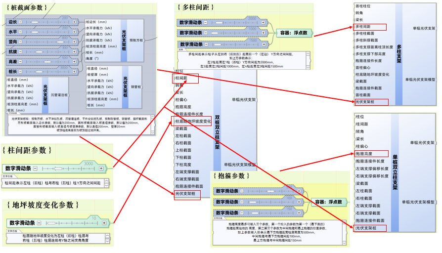  

单榀参数B

### 支架参数定义

默认情况下组件X、Y向偏移为0，即组件在两个方向均居中布置，两个方向偏移即从居中位置偏移。组件布置间距为组件在组件平面上之间的间距。组件据檩条高度为组件板中心线到檩条轴线的垂直最短距离，默认为檩条高度+组件板一半厚度。组件转向即为组件长度与宽度参数对调。支架位置通过接入如图所示的数组定位各个单榀光伏支架的位置，接入的参数表示距离前面建立的单榀光伏支架的距离.上述参数的意义为:支架第1榀支架距离单榀光伏支架为0，支架第2榀支架距离单榀光伏支架为3400，支架第3榀支架距离单榀光伏支架为6800，支架第4榀支架距离单榀光伏支架为10200，支架第5榀支架距离单榀光伏支架为13600。檩条悬挑长度为檩条超出支架两侧的长度，通过数字滑动条等输入参数，檩条位置通过接入如图所示的数组定位各个檩条的位置，接入的参数表示檩条距离左侧（前侧）梁起点的长度。上述参数的意义为，第1行檩条距离梁起点距离为7，第2行檩条距离梁起点距离为1374，第3行檩条距离梁起点距离为1696，第4行檩条距离梁起点距离为2628，第5行檩条距离梁起点距离为3400。
用户可选择组件是否打断檩条，即组件起终点处是否打算檩条，打断檩条时组件施加给檩条上的均为均布荷载，不打端檩条时，组件施加到檩条上的荷载 满布时为均布荷载，不满布时为按长度计算的打折的均布荷载。当组件超过檩条悬挑长度时，组件施加到檩条的荷载也是按长度计算的超载荷载。用户也可选择自动布置模式，打开此模式时，Y-GAMA根据组件的数量与尺寸，自动设置支架位置，檩条位置，单榀支架梁长等参数，使得支架契合组件尺寸，如图所示。

  
  
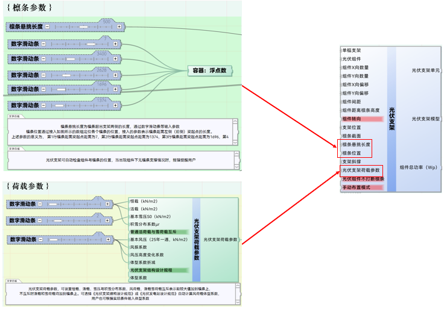  

支架参数定义

## 优化模型

如图所示，光伏支架模型出口接入“生成YJK模型”、“计算YJK模型”后接入“结构指标”、“构件指标（构件）”即可设置优化目标：最少用钢量与约束 柱顶位移小于1/60、梁构件超限数量小于2条。我们可以选择任意建模参数作为优化参数。

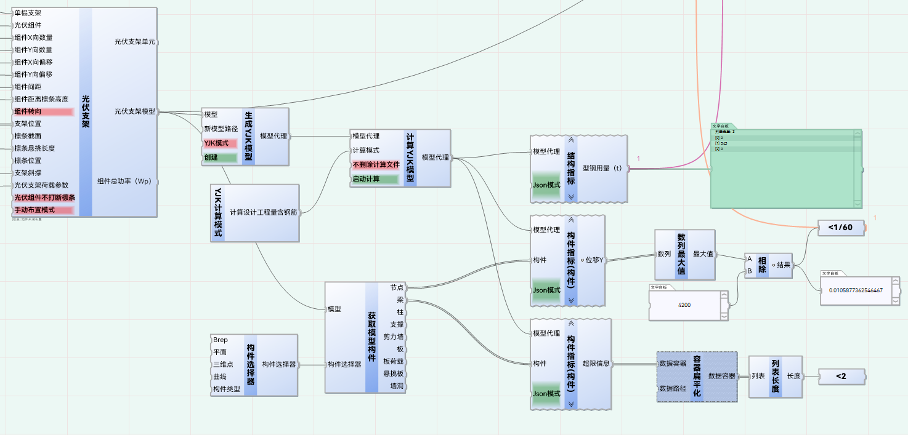  

优化模型

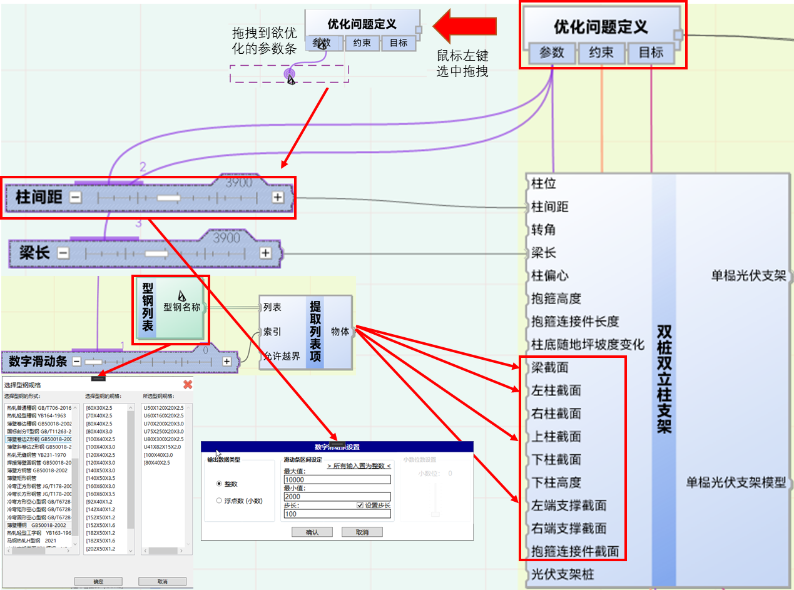 

单榀支架优化参数设定

以图所示为例，一个单榀光伏支架接入了柱间距、梁长数字滑动条、型钢列表，数字滑动条可以双击弹出设置，我们可以设置最大值、最小值、步长可以成较大的整数否则会计算量大非常的不经济。同样的，型钢列表可通过左键弹出选择型钢规格，此处可将优化时待选择的型钢类型添加到型钢列表，通过“提取列表项”卡片和数字滑动条作为索引可逐个提取型钢列表中的型钢截面，注意此处数字滑动条需定义最大值为型钢列表长度-1，将提取列表项出口“物体”连接到任意截面，如梁截面、柱截面、支撑截面，即可在优化过程中，自动逐个选择型钢列表中截面计算。

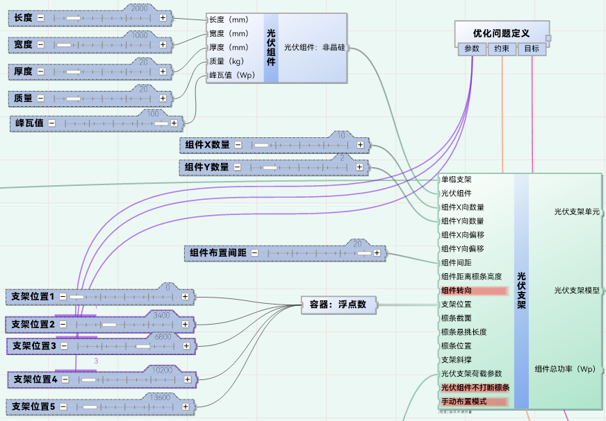  

支架优化参数设定

光伏支架卡片优化参数定义与单榀的定义类似，此处以支架间距为例。光伏支架位置通过一系列的数字滑动条定义各个支架与第一榀光伏支架的间距，不将优化参数接入第1榀和最后1榀的位置，即可实现其位置的固定，相应的，接入优化参数的第2、3、4榀的位置方能参与优化过程。

  

支架优化目标设定

以光伏兆瓦用钢量为例介绍优化问题目标的连接方法。使用“结构指标：材料用量”获取模型中的钢用量，由于光伏支架模型建立在空间层，而材料用量卡片获取的是各个标准层的，所以需要提取出空间层的模型的材料用量，光伏支架出口组件总功率是按照用户输入的每块光伏组件峰瓦值和X、Y两个方向的数量相乘的结果，除10６换算成兆瓦值，用钢量T除发电兆瓦值Mw即得到兆瓦用钢量T/Mw，接入约束条件：大于200即可设定为优化目标。
参照以上的示例，用户可任意定义优化的参数，将光伏支架在用户给定的范围内优化为最优解。

## 优化案例

如图所示，双桩双立柱支架，要在所选截面库中选择满足约束条件的，用钢量最小的檩条截面，按照图示连接卡片，其结果如图9-5所示，计算了7个模型，用时约10余分钟，模型由最初的0.7t，优化结果为0.45t，节约35%的用钢量。

优化案例

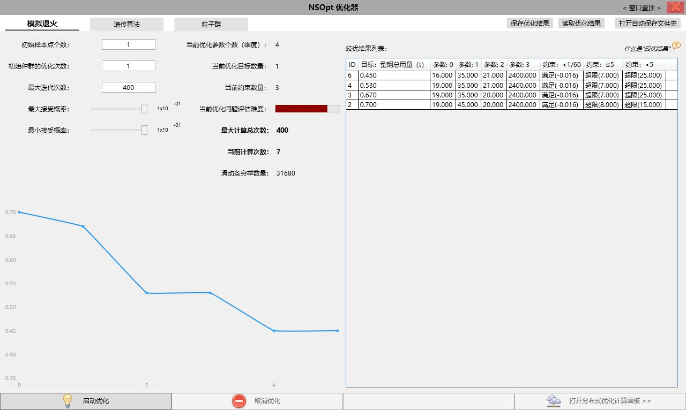  

优化结果

