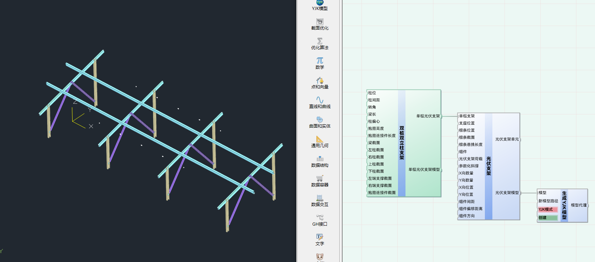

# 双桩双立柱支架

建立单榀双桩双立柱支架

## 输入端(InputSide)

|名称|描述|数据结构|数据类型|
|:--|:--|:--|:--|
|柱位|柱位|单个数据|Point3d
|柱间距|柱子之间的间距|单个数据|Double
|转角|梁的转角|单个数据|Double
|梁长|梁长|单个数据|Double
|柱偏心|柱偏心|单个数据|Double
|抱箍高度|抱箍高度|单个数据|Double
|抱箍连接件长度|抱箍连接件长度|单个数据|Double
|柱底随地坪坡度变化|柱底随地坪坡度变化|单个数据|Double
|梁截面|梁截面|单个数据|NSFrameSection
|左柱截面|左柱截面|单个数据|NSFrameSection
|右柱截面|右柱截面|单个数据|NSFrameSection
|上柱截面|上柱截面|单个数据|NSFrameSection
|下柱截面|下柱截面(只适用于圆管)|单个数据|NSFrameSection
|下柱高度|下柱高度|单个数据|Double
|左端支撑截面|左端支撑截面|单个数据|NSFrameSection
|右端支撑截面|右端支撑截面|单个数据|NSFrameSection
|抱箍连接件截面|抱箍连接件截面|单个数据|NSFrameSection
|光伏支架桩|光伏支架桩|单个数据|NSPile

## 输出端(OutputSide)

|名称|描述|数据结构|数据类型|
|:--|:--|:--|:--|
|单榀光伏支架|单榀光伏支架|单个数据|NSPVSupportBase
|单榀光伏支架模型|单榀光伏支架模型|单个数据|NSModel

## 示例

