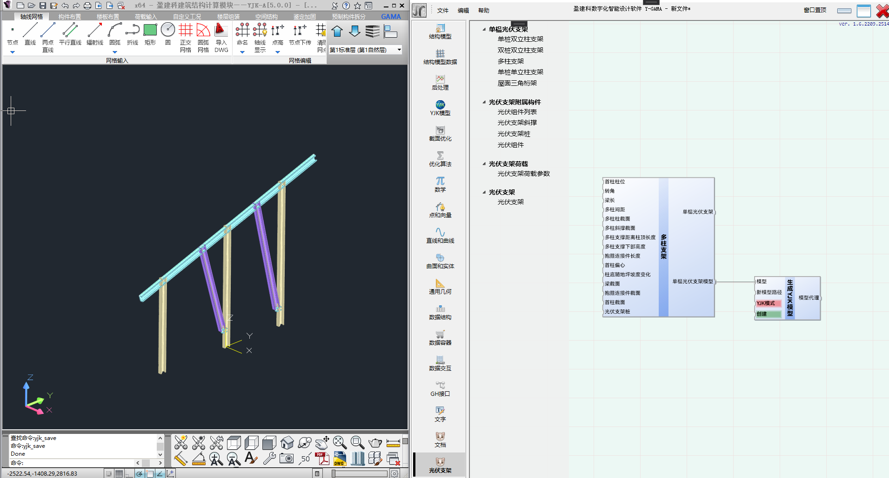

# 多柱支架

建立单榀双桩双立柱支架

## 输入端(InputSide)

|名称|描述|数据结构|数据类型|
|:--|:--|:--|:--|
|首柱柱位|首柱柱位|单个数据|Point3d
|梁倾角|梁的倾角|单个数据|Double
|梁长|梁长|单个数据|Double
|多柱间距|多柱间距|列表数据|Double
|多柱柱截面|多柱柱截面|列表数据|NSFrameSection
|多柱斜撑截面|多柱斜撑截面|列表数据|NSFrameSection
|多柱支撑距离柱顶长度|多柱支撑距离柱顶长度|列表数据|Double
|多柱支撑下部高度|多柱支撑下部高度|列表数据|Double
|抱箍连接件长度|抱箍连接件长度|单个数据|Double
|首柱偏心|首柱偏心|单个数据|Double
|柱底随地坪坡度变化|柱底随地坪坡度变化|单个数据|Double
|梁截面|梁截面|单个数据|NSFrameSection
|抱箍连接件截面|抱箍连接件截面|单个数据|NSFrameSection
|首柱截面|首柱截面|单个数据|NSFrameSection
|光伏支架桩|光伏支架桩|单个数据|NSPile

## 输出端(OutputSide)

|名称|描述|数据结构|数据类型|
|:--|:--|:--|:--|
|单榀光伏支架|单榀光伏支架|单个数据|NSPVSupportBase
|单榀光伏支架模型|单榀光伏支架模型|单个数据|NSModel

## 示例

